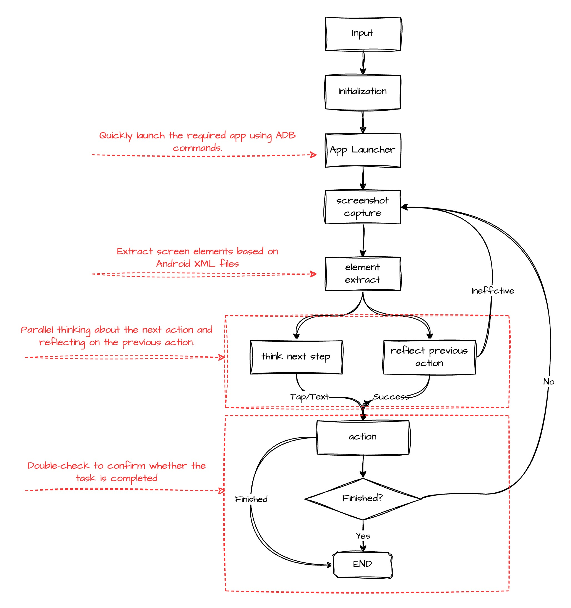

# <center> Android Agent: a LangGraph-Based agent for Android use </center>

## Features
1. More standardized: All components are built based on langgraph/langchain and can be easily integrated into your langchain project.
2. Faster startup: Launch the relevant app directly using adb commands.
3. Faster understanding: Identify screen elements based on Android XML files without using OmniParser.
4. Faster thinking: Run reasoning and reflection in parallel, reducing each step to within 15 seconds. 
<center>
  
</center>

## Getting Start

### Installation

```bash
conda create -n android_agent python=3.10
conda activate android_agent

git clone https://github.com/JeunyuLi/Android_agent.git
cd Android_agent
pip install -r requirements.txt
```

### ADB

#### 1. Download ADB and install

Windows version：[https://dl.google.com/android/repository/platform-tools-latest-windows.zip](https://dl.google.com/android/repository/platform-tools-latest-windows.zip)
Mac version：[https://dl.google.com/android/repository/platform-tools-latest-darwin.zip](https://dl.google.com/android/repository/platform-tools-latest-darwin.zip)
Linux version：[https://dl.google.com/android/repository/platform-tools-latest-linux.zip](https://dl.google.com/android/repository/platform-tools-latest-linux.zip)

#### 2. Add ADB to the Environment Variable

1. Unzip the downloaded package first. The adb.exe file will be in the unzipped folder. (Remember this path.)
2. Go back to the desktop, right-click **This PC** → **Properties** → **Advanced system settings** → **Environment Variables**.
3. Click **New** in the **system variables**, enter the variable name as **adb**(customized), and the variable value as **to  <platform-tools>**(the path of the adb tool).
4. Click **Path**, then click **New** and enter **%adb%**.
5. Open the command prompt (cmd) and type **adb version**. If the version number appears, the setup is successful.

[Setting up ADB Path on Windows: Android Tips.](https://theflutterist.medium.com/setting-up-adb-path-on-windows-android-tips-5b5cdaa9084b)

#### 3. Install ADBKeyboard

- download the .apk file and install it on your android device

[https://github.com/senzhk/ADBKeyBoard](https://github.com/senzhk/ADBKeyBoard)

#### 4. ADB connect device

```bash
adb connect <your device ip>
```

## Configuration

- Configure the model by setting OPENAI_API_BASE and OPENAI_API_KEY to your own.
    
    (Note: Currently, only Azure's OpenAI models are supported. Others will be added later.)
    

```yaml
MODEL: "OpenAI"
OPENAI_API_BASE: ""
OPENAI_API_KEY: ""  # Set the value to sk-xxx if you host the openai interface for open llm model
OPENAI_API_MODEL: "gpt-4o"  # The only OpenAI model by now that accepts visual input
MAX_TOKENS: 300  # The max token limit for the response completion
TEMPERATURE: 0.0  # The temperature of the model: the lower the value, the more consistent the output of the model
REQUEST_INTERVAL: 5  # Time in seconds between consecutive GPT-4V requests

DEVICE_IP: ip:5555 # Your device ip
APP_MAPPING_FILE: "configs/app2package_CN.yaml" # The path of the app mapping file

```

- Configure the application name and package name mapping table.
    
    (No modification is required. If there are any apps that need to be used, please add them on your own)
    

## Run

```bash
python run.py
```

## TO_DO

## Related Link

• [AppAgent](https://arxiv.org/abs/id) - First LLM-based intelligent smartphone application agent